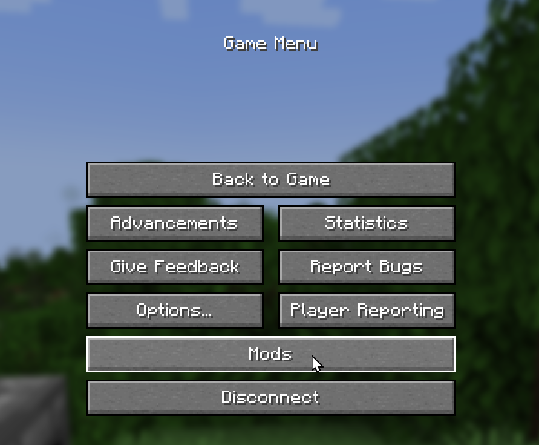
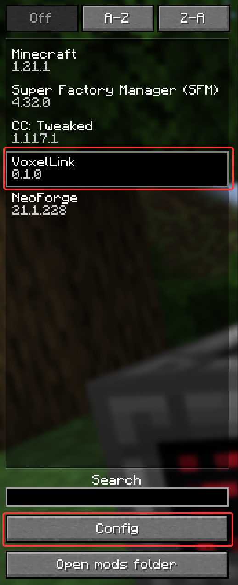
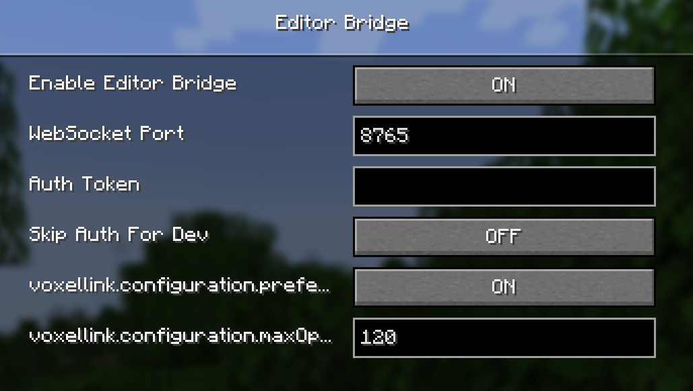

## About

VoxelLink connects external code editors like VS Code, Neovim, or any tool that speaks WebSocket to in-game scripting targets while you play Minecraft. Instead of writing and debugging scripts on an in-game terminal, you can use a full editor with syntax highlighting, search, and your usual workflow, then save changes directly back to the game.

Supported backends include **CC: Tweaked** computers (multi-file Lua projects) and **Super Factory Manager** manager disks (a single `program.sfml` file per manager). Install whichever backends you use; VoxelLink enables features for the mods present in your pack.

The mod adds a **client-side WebSocket server** on your machine. Your editor connects locally, the mod forwards file operations to the Minecraft server through custom packets, and each backend handles the actual storage access using its normal permission rules. Nothing is exposed to the wider network. The bridge binds to `127.0.0.1` only.

```
editor  <->  client (WebSocket)  <->  server (packets)  <->  script backends (CC, SFM, ...)
```

This works in single-player and multiplayer. On a dedicated server, each player's client runs its own localhost bridge. Your editor always connects to the client on your PC, not to the server or other players.

**Requirements:** Minecraft 1.21.1 and NeoForge. At least one supported backend is needed for file editing: [CC: Tweaked](https://www.curseforge.com/minecraft/mc-mods/cc-tweaked) and/or [Super Factory Manager](https://www.curseforge.com/minecraft/mc-mods/super-factory-manager). VoxelLink is not affiliated with these mods.

## Features

### External editor integration

- Localhost WebSocket server on your Minecraft client (default port `8765`)
- JSON-over-WebSocket protocol for editor plugins, scripts, and tooling
- Optional token authentication so only your tools can connect
- Configurable rate limiting to prevent accidental request flooding

### File operations

- List, read, write, and delete files on supported targets (capabilities vary by backend)
- Real-time `file_event` notifications pushed to editors when files change in-game
- Target discovery lets you query accessible computers and managers from your editor
- Path traversal (`..`) is rejected and backend permission rules still apply

### Target identification

Identify targets with namespaced ids:

| Backend | Format | Example | Notes |
|---------|--------|---------|-------|
| CC (position) | `cc:pos:...` | `cc:pos:minecraft:overworld:10:64:-5` | Reliable for any placed computer |
| CC (label) | `cc:label:...` | `cc:label:my-controller` | Uses `os.setComputerLabel()` in CC |
| SFM (manager) | `sfm:pos:...` | `sfm:pos:minecraft:overworld:12:64:-3` | Single virtual file `program.sfml` |

Use `/voxellink id` in-game while looking at a CC computer or SFM manager with a disk inserted to see available ids.

### In-game tools

- **`vledit`**, a ROM program on CC computers that opens a file in your connected editor from inside a CC terminal
- **`/voxellink` commands** for status, self-test, config reload, target lookup, and file listing

| Command | Description |
|---------|-------------|
| `/voxellink status` | Bridge status and connection info |
| `/voxellink test` | Self-test WebSocket and packet path |
| `/voxellink reload` | Reload client config from disk |
| `/voxellink id` | Show ids for the block you're looking at |
| `/voxellink list [target]` | List files on a target |

From a CC terminal, run `vledit startup.lua` to request that file open in your editor (your editor must already be connected).

## Getting Started

1. **Install** VoxelLink with NeoForge for Minecraft 1.21.1, plus CC: Tweaked and/or Super Factory Manager if you use those mods.

2. **Enable the bridge.** The link is off by default — turn it on in-game or edit the config file.

### Enable in-game

1. Open the pause menu and click **Mods**.



2. Select **VoxelLink** in the mod list, then click **Config**.



3. Set **Enable Editor Bridge** to **ON**. Optionally set a **WebSocket Port** (default `8765`) and **Auth Token**, then save.



| Setting | Description |
|---------|-------------|
| Enable Editor Bridge | Turns the localhost WebSocket server on or off |
| WebSocket Port | Port your editor connects to (default `8765`) |
| Auth Token | Optional secret; editors must send this to connect |
| Skip Auth For Dev | Dev-only bypass for local testing |
| Prefer Label IDs | Prefer CC label ids over position ids when both exist |
| Max Operations Per Minute | Rate limit for editor requests (`0` = unlimited) |

### Enable via config file

Alternatively, edit `config/voxellink-client.toml`:

```toml
enabled = true
socketPort = 8765
authToken = "your-secret-token"
preferLabelIds = true
maxOperationsPerMinute = 120
```

Use `/voxellink reload` in-game after editing the file, or restart the client.

4. **Find a target id** by looking at a CC computer or SFM manager in-game and running `/voxellink id`.

5. **Connect your editor** to `ws://127.0.0.1:8765/`. Authenticate with your token if you set one, then use the protocol to read and write files on the target.

6. **Verify it works** with `/voxellink test` in-game or `vledit <file>` from a CC terminal.

The mod ships with an [editor protocol spec](https://github.com/BeronnisDev/VoxelLink/blob/main/docs/EDITOR_PROTOCOL.md) and an [example Python client](https://github.com/BeronnisDev/VoxelLink/blob/main/examples/editor_client.py) for building your own integration.

### Links

- [GitHub repository](https://github.com/BeronnisDev/VoxelLink)
- [Editor protocol documentation](https://github.com/BeronnisDev/VoxelLink/blob/main/docs/EDITOR_PROTOCOL.md)
- [Example Python editor client](https://github.com/BeronnisDev/VoxelLink/blob/main/examples/editor_client.py)

Report bugs and request features on GitHub Issues.
